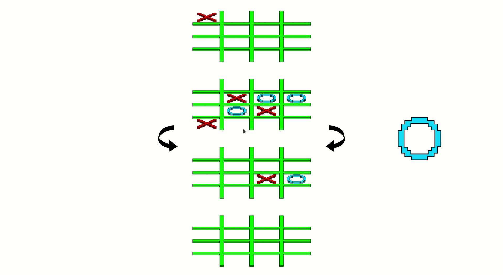
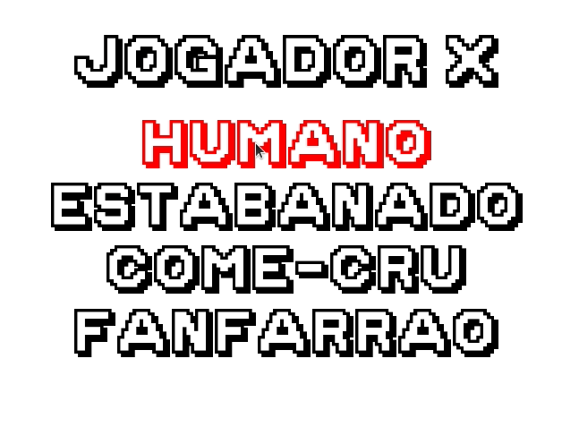

**Qubric** é um jogo da velha em 3D. O tabuleiro é uma grade 4x4x4.
As regras são as mesmas do jogo da velha comum. \
Porém as novas verticais, tranversais e diagonais também são vitoriosas.

## Bots

O jogo pode ser jogado entre duas pessoas, mas também são providos Bots para os solitários. \
Cada Bot implementa uma estratégia diferente.

- O **Estabanado** joga numa posição aleatória do tabuleiro.

- O **Come-Cru** procura a primeira posição livre no tabuleiro e joga nela.

- O **Fanfarrão** paga de bom, mas só vê a próxima jogada. Se ele tiver
como ganhar o jogo, ele faz isso. \
Se não, ele tenta impedir que o oponente ganhe na próxima jogada.

## Instalação

A versão do Python testada foi a partir da 3.8.5

    $ pip3 install pygame
    $ pip3 install numpy

E para rodar os testes é também necessário instalar a pytest

    $ pip3 install pytest

## Execução

    $ python3 main.py

## Desenvolvedores

- Antonio Marcos Shiro Arnauts Hachisuca,   NUSP: 11796041
- Luã Nowacki Scavacini Santilli,           NUSP: 11795492
- Maximilian Cabrajac Goritz,               NUSP: 11795418

## Créditos

- Flechas curvadas por Simon Mettler do "the Noun Project"
- Fonte Golden Age por imagex

<!--
curved arrow by Simon Mettler from the Noun Project
>
